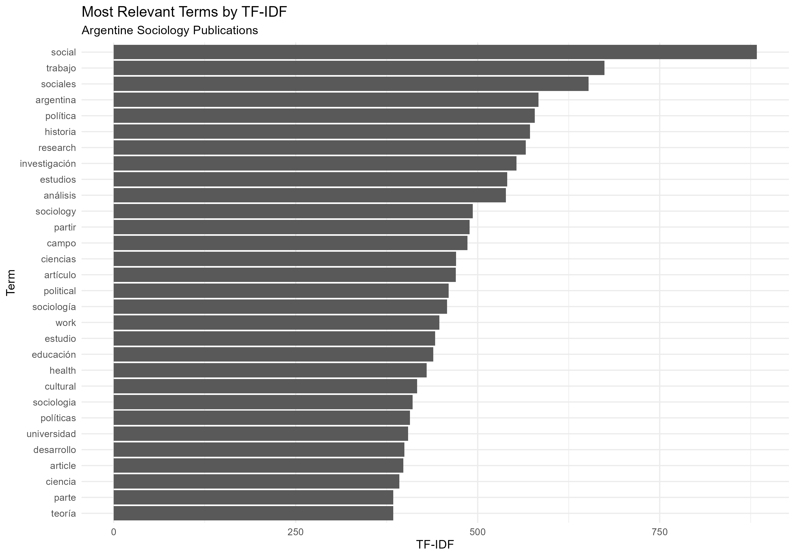
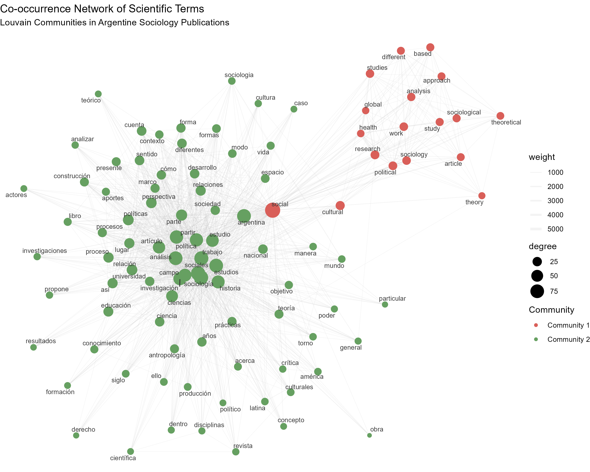
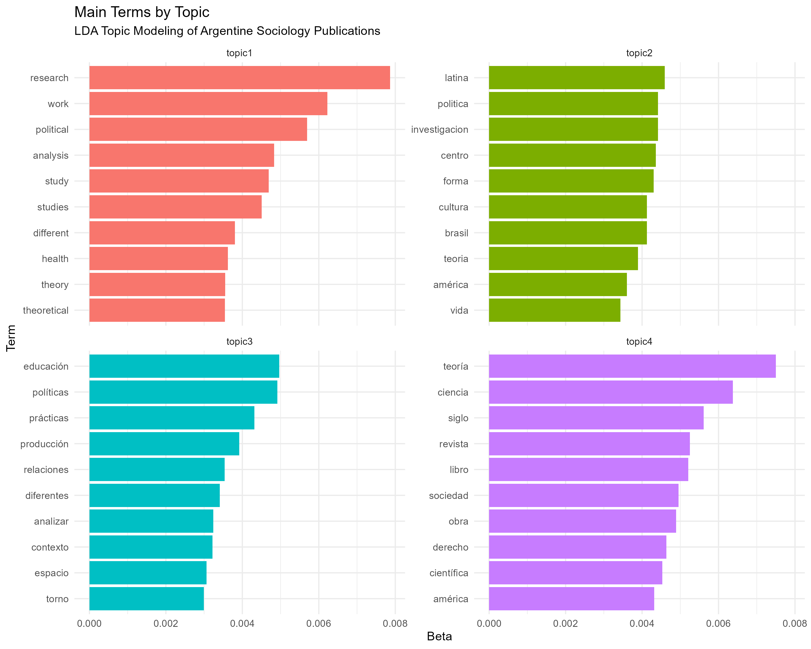
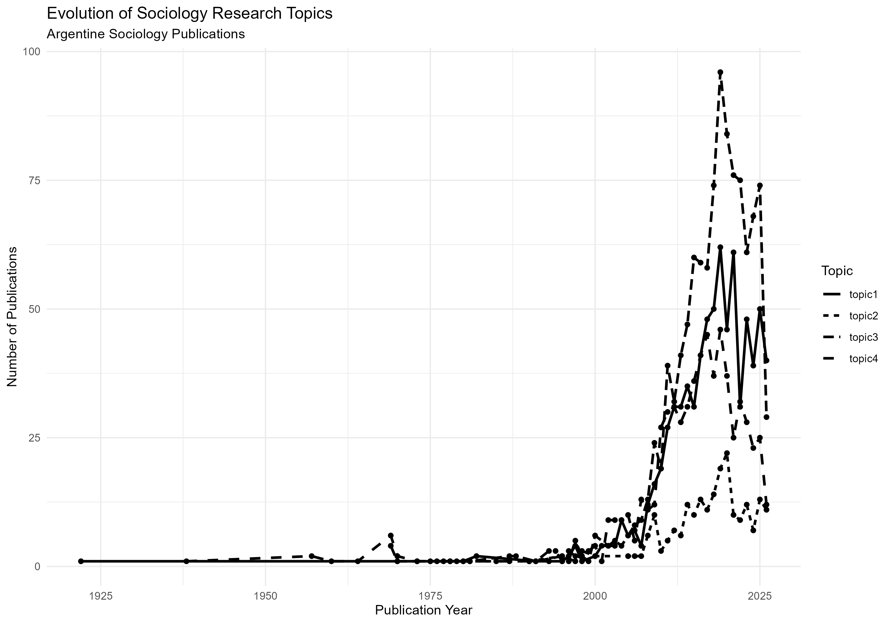

# Text Mining & Topic Modeling

## Análisis de producción científica argentina sobre Sociología

Este proyecto presenta un análisis de minería de textos y modelado de tópicos aplicado a publicaciones científicas sobre Sociología asociadas a instituciones de Argentina.

El objetivo es explorar la estructura temática del corpus, identificar términos relevantes, analizar relaciones entre conceptos y observar la evolución de los temas a través del tiempo.

## Objetivo

Analizar un corpus de publicaciones científicas para identificar:

- términos relevantes dentro de los documentos;
- relaciones de coocurrencia entre conceptos;
- comunidades de términos dentro de la red;
- principales estructuras temáticas del corpus;
- evolución de los temas a través del tiempo.

## Datos

Los datos bibliográficos fueron obtenidos directamente desde **OpenAlex** mediante consultas realizadas en R.

La búsqueda se realizó sobre trabajos asociados a instituciones de Argentina utilizando términos relacionados con Sociología en distintos idiomas.

La consulta recuperó **2.893 publicaciones**, de las cuales **2.743 contaban con resumen (abstract)** y fueron utilizadas para el análisis textual.

> **Nota:** OpenAlex es una fuente dinámica, por lo que el número de resultados puede variar si la consulta se ejecuta nuevamente.

## Metodología

El análisis se desarrolló mediante las siguientes etapas:

1. Adquisición de datos desde OpenAlex.
2. Selección de variables relevantes.
3. Eliminación de registros sin abstract.
4. Conversión del texto a minúsculas.
5. Eliminación de signos de puntuación.
6. Tokenización.
7. Eliminación de stopwords en español, inglés, francés, alemán, italiano y portugués.
8. Eliminación de tokens numéricos.
9. Construcción de una matriz documento-término.
10. Análisis TF-IDF.
11. Construcción de una red de coocurrencia.
12. Detección de comunidades mediante el algoritmo de Louvain.
13. Modelado de tópicos mediante LDA.
14. Análisis temporal de la distribución de los tópicos.

## Técnicas utilizadas

### TF-IDF

Se utilizó TF-IDF para identificar términos con mayor relevancia dentro del corpus.



### Red de coocurrencia

Se construyó una red basada en la aparición conjunta de términos dentro de los documentos.

Los nodos representan términos y las conexiones representan relaciones de coocurrencia.

El tamaño de los nodos representa su grado de conexión y el peso de las aristas representa la intensidad de la relación.



### Comunidades de Louvain

El algoritmo de Louvain permitió identificar **tres comunidades principales de términos** dentro de la red.

Estas comunidades representan agrupaciones de conceptos que presentan patrones de conexión más fuertes entre sí.

### Topic Modeling con LDA

Se aplicó un modelo **Latent Dirichlet Allocation (LDA)** con cuatro tópicos.

Los términos principales sugieren diferentes áreas temáticas relacionadas con:

- educación, políticas y género;
- sociedad, teoría y producción de conocimiento;
- investigación, análisis y estudios científicos;
- producción académica, cultura y conocimiento.

Estas interpretaciones son exploratorias y se basan en los términos con mayor probabilidad dentro de cada tópico.



### Evolución temporal

Finalmente, se analizó la distribución de los tópicos según el año de publicación para explorar cómo cambia la presencia de los temas a través del tiempo.



## Herramientas

- R
- Tidyverse
- Quanteda
- Quanteda Textstats
- Igraph
- Ggraph
- Tidytext
- OpenAlex / openalexR

## Estructura del proyecto

```text
01-text-mining-topic-modeling/
│
├── README.md
│
├── code/
│   └── text-mining.R
│
└── images/
    ├── tfidf_top_terms.png
    ├── cooccurrence_network.png
    ├── lda_topics.png
    └── topic_evolution.png

